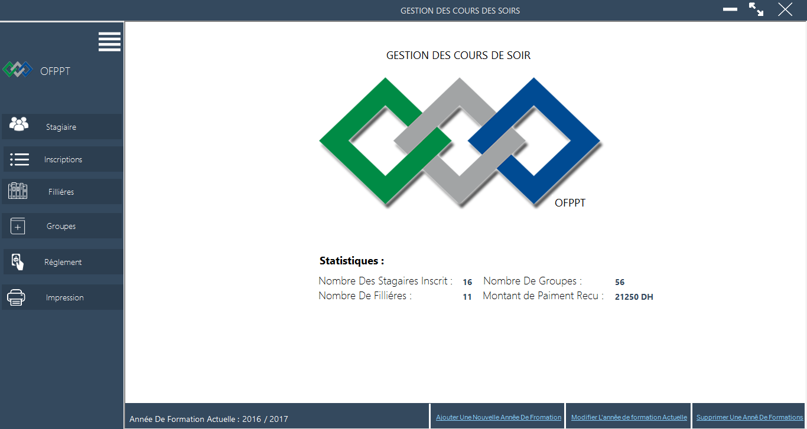
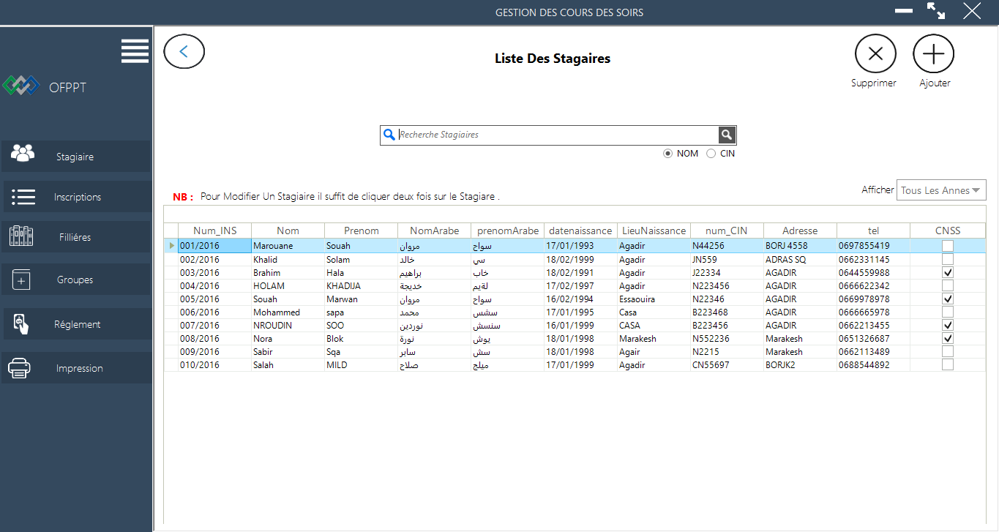
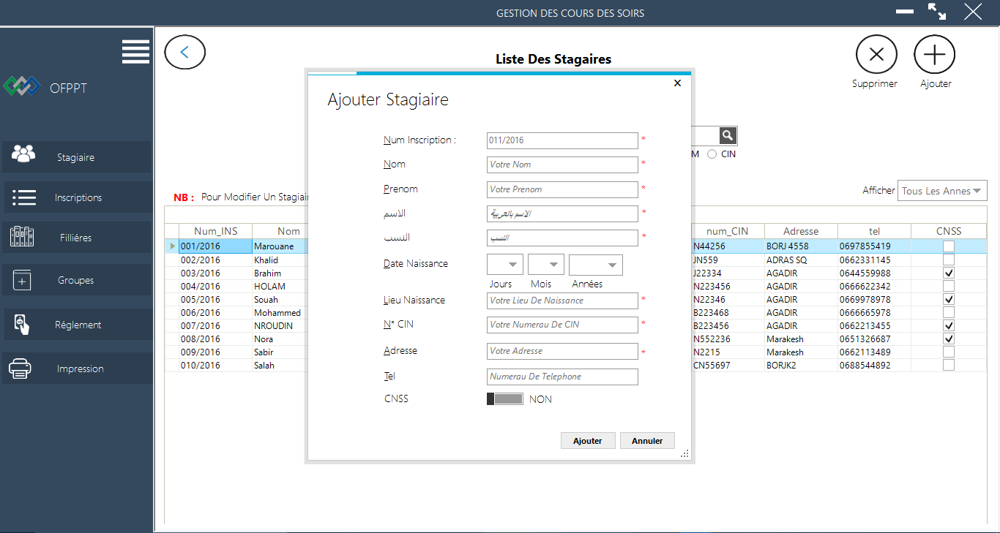
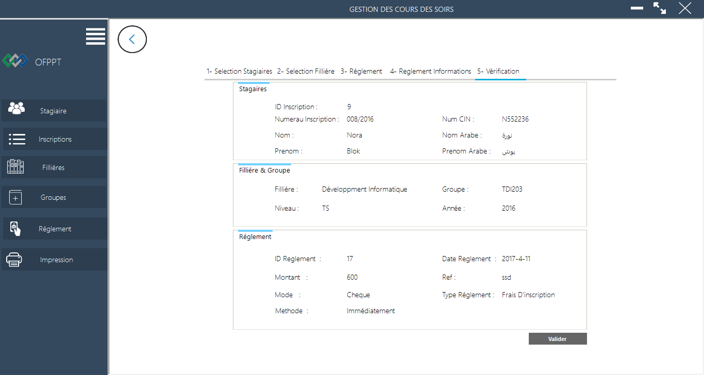
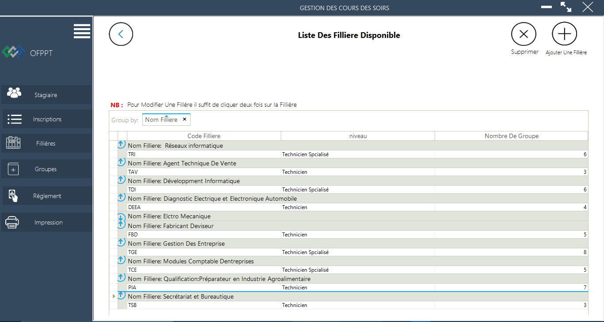
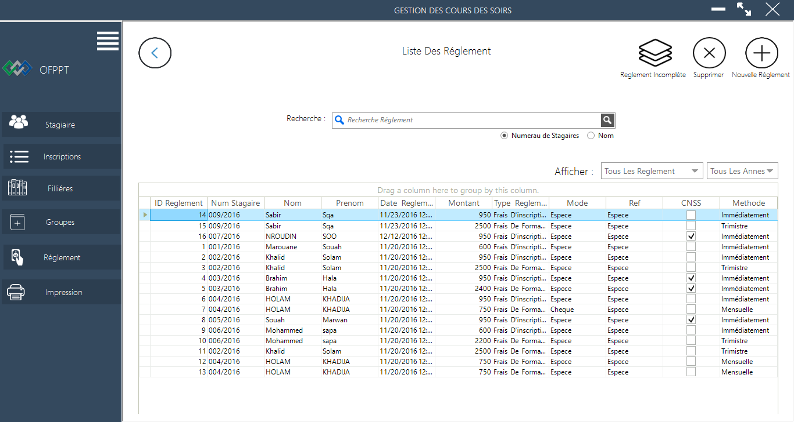
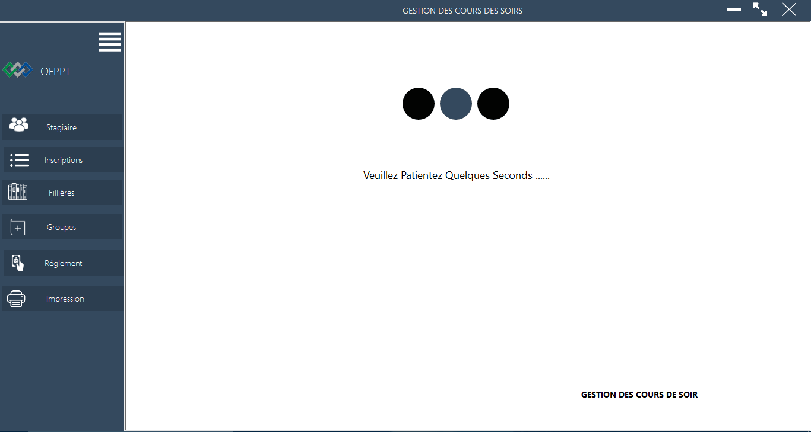
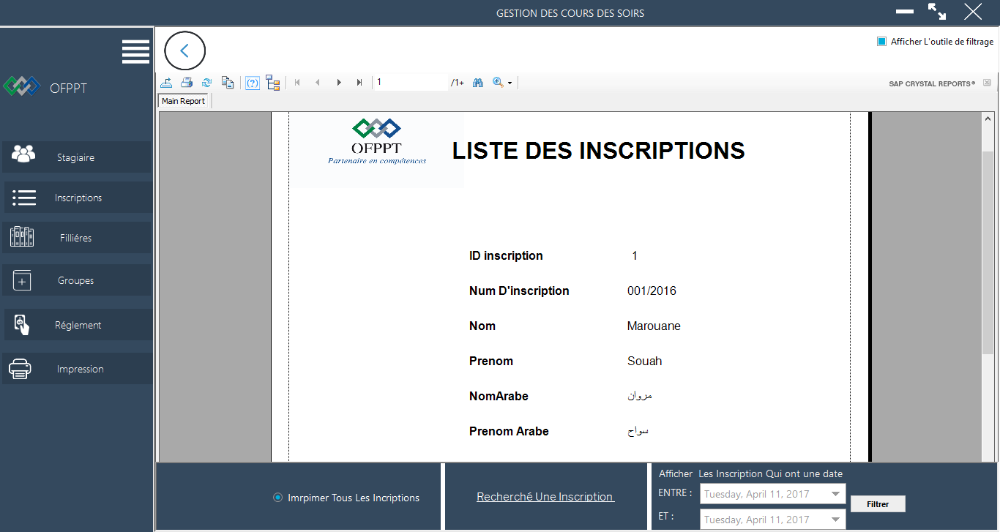

# Gestion Stagaire OFPP ,
Gestion Stagiaire OFPPT ,développé par Marouane Souah

################################

1 - Avant d'utiliser cette application vous devez premièrement telecharger les fichier des base de donnes que vous le trouverez dans le dossier "BASE DONNES" et le mettre dans le chemins suivant:
==> [64Bits] C:\Program Files (x86)\Microsoft SQL Server\MSSQL12.MSSQLSERVER\MSSQL\DATA\
==> [32Bits] C:\Program Files (x86)\Microsoft SQL Server\MSSQL12.MSSQLSERVER\MSSQL\DATA\
2 - Vous devez telecharger Metro Framework  <a href="https://github.com/thielj/MetroFramework">ICI</a> 
3 - Vous devez telecharger Crystal Report , pour que la section d'impression fonctionne correctement

#################################

Si vous avez un problème veuillez me  <a href="https://www.facebook.com/Marwan.Esaaouira">contacter</a> 

